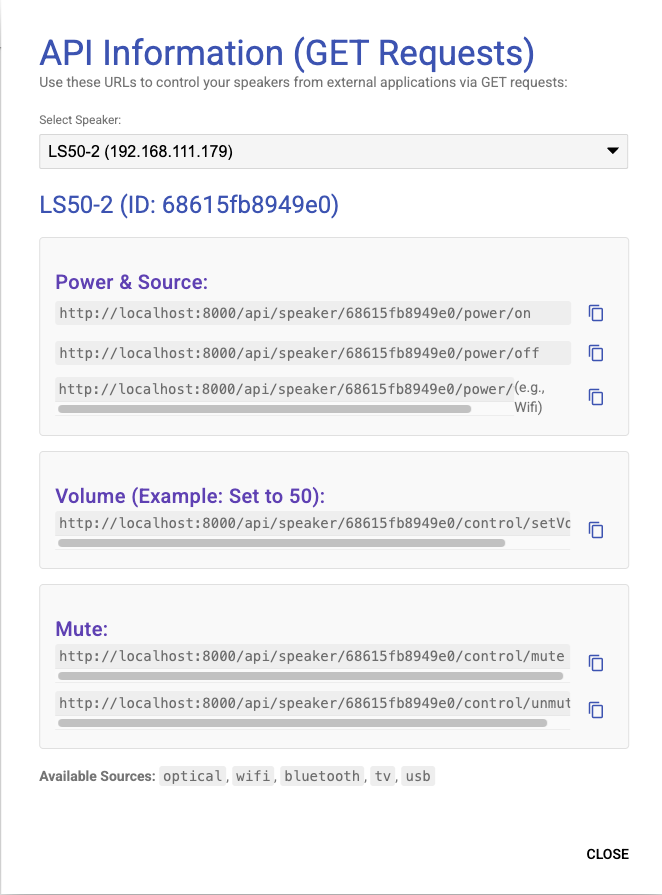

# KEF Control Panel

## Project Description

This is a web application designed to control KEF LS50 Wireless II, LSX II and LS60 speakers. It provides a user-friendly interface for managing multiple speakers, controlling their core functionalities (power, volume, source, mute), and offers a REST API for external integration.

## Technologies Used

-   **Backend:** PHP
    -   Handles speaker configuration (stored in `speakers.json`).
    -   Provides a REST API for speaker control and status retrieval.
    -   Utilizes the `KefConnector` class for communication with KEF speakers via their HTTP API.
-   **Frontend:** HTML, JavaScript, CSS
    -   Single-page application (SPA) structure.
    -   **Material Design Lite (MDL):** For a responsive and modern user interface.
    -   **SortableJS:** For drag-and-drop functionality in speaker reordering.

## Key Features

-   **Speaker Management (CRUD):** Add, edit, delete, and reorder speakers.
-   **Dashboard:** Displays configured speakers with real-time status updates, including speaker ID and model name.
-   **Core Controls:** Power on/off, volume adjustment, source selection, mute/unmute.
-   **Playback Controls:** Play/pause, next track, previous track.
-   **Group Controls:** Turn all speakers off or mute/unmute all simultaneously.
-   **REST API:** Allows external applications to control speakers via GET and POST requests.
-   **Application Settings:** Configure application's base URL and base path. Control debug mode (enables/disables debug logging and UI button visibility).
-   **Debug Mode:** Toggles display of raw API responses for troubleshooting.
-   **API Info Overlay:** Provides a quick reference for GET API endpoints for each configured speaker.
-   **Manual Refresh:** Button to manually refresh speaker status.
-   **Auto-Refresh Toggle:** Button to pause/resume automatic status updates.

## Webinterface

The web interface provides a user-friendly way to control your KEF speakers.

### Dashboard


### API Info Overlay


## How to Run the Application

1.  **Prerequisites:** Ensure you have PHP installed.
2.  **Navigate to Project Root:** Open your terminal and navigate to the project's root directory (`/Users/marcus/Projects/kef`).
3.  **Start PHP Development Server:** Run the following command:
    ```bash
    php -S localhost:8000
    ```
    (You can change `localhost:8000` to your desired host and port.)
4.  **Access in Browser:** Open your web browser and go to `http://localhost:8000` (or your configured host and port).

## API Endpoints Overview

The application exposes a REST API for speaker control. All API endpoints are relative to the application's base URL and base path (e.g., `http://localhost:8000/api/...`).

-   **Speaker Management:**
    -   `GET /api/speakers`: Get all configured speakers.
    -   `POST /api/speakers`: Add a new speaker.
        ```bash
        curl -X POST -H "Content-Type: application/json" -d '{"name":"Living Room Speaker","ip":"192.168.1.100"}' http://localhost:8000/api/speakers
        ```
    -   `PUT /api/speakers/{id}`: Update an existing speaker.
        ```bash
        curl -X PUT -H "Content-Type: application/json" -d '{"name":"Updated Living Room Speaker"}' http://localhost:8000/api/speakers/YOUR_SPEAKER_ID
        ```
    -   `DELETE /api/speakers/{id}`: Delete a speaker.
        ```bash
        curl -X DELETE http://localhost:8000/api/speakers/YOUR_SPEAKER_ID
        ```
    -   `POST /api/speakers/reorder`: Reorder speakers.
        ```bash
        curl -X POST -H "Content-Type: application/json" -d '["ID1", "ID3", "ID2"]' http://localhost:8000/api/speakers/reorder
        ```

-   **Speaker Control (GET & POST):**
    -   `GET /api/speaker/{id}/power/{state}`: Set power state or source.
        -   Power On: `http://localhost:8000/api/speaker/YOUR_SPEAKER_ID/power/on`
        -   Power Off: `http://localhost:8000/api/speaker/YOUR_SPEAKER_ID/power/off`
        -   Set Source (e.g., Optical): `http://localhost:8000/api/speaker/YOUR_SPEAKER_ID/power/optical` (Note: Setting a source will also power on the speaker if it's off.) (Note: Setting a source will also power on the speaker if it's off.)
    -   `POST /api/speaker/{id}/power`: Set power state via JSON body.
        ```bash
        curl -X POST -H "Content-Type: application/json" -d '{"state": "on"}' http://localhost:8000/api/speaker/YOUR_SPEAKER_ID/power
        ```
    -   `GET /api/speaker/{id}/control/{action}/{value}`: Control speaker actions.
        -   Set Volume to 50: `http://localhost:8000/api/speaker/YOUR_SPEAKER_ID/control/setVolume/50`
        -   Mute: `http://localhost:8000/api/speaker/YOUR_SPEAKER_ID/control/mute`
        -   Unmute: `http://localhost:8000/api/speaker/YOUR_SPEAKER_ID/control/unmute`
        -   Toggle Play/Pause: `http://localhost:8000/api/speaker/YOUR_SPEAKER_ID/control/togglePlayPause`
        -   Next Track: `http://localhost:8000/api/speaker/YOUR_SPEAKER_ID/control/nextTrack`
        -   Previous Track: `http://localhost:8000/api/speaker/YOUR_SPEAKER_ID/control/prevTrack`
    -   `POST /api/speaker/{id}/control`: Control speaker actions via JSON body.
        ```bash
        curl -X POST -H "Content-Type: application/json" -d '{"action": "setVolume", "value": 50}' http://localhost:8000/api/speaker/YOUR_SPEAKER_ID/control
        ```
    -   `GET /api/speaker/{id}/status`: Get current speaker status.
        ```bash
        curl http://localhost:8000/api/speaker/YOUR_SPEAKER_ID/status
        ```
    -   `GET /api/speaker/{id}/modelName`: Get speaker model name.
        ```bash
        curl http://localhost:8000/api/speaker/YOUR_SPEAKER_ID/modelName
        ```

-   **Application Configuration:**
    -   `GET /api/config`: Get application settings.
    -   `POST /api/config`: Save application settings.
        ```bash
        curl -X POST -H "Content-Type: application/json" -d '{"app_base_url":"http://my-domain.com","debug_enabled":true}' http://localhost:8000/api/config
        ```

## File Structure

-   `index.html`: Main application entry point (frontend).
-   `css/style.css`: Custom CSS styles.
-   `js/api.js`: JavaScript functions for interacting with the backend API.
-   `js/app.js`: Main frontend application logic.
-   `api/`: Backend PHP files.
    -   `index.php`: Main API router.
    -   `speakers.php`: Handles speaker CRUD operations.
    -   `config.php`: Handles application configuration operations.
    -   `KefConnector.php`: PHP class for communicating with KEF speakers via their HTTP API.
    -   `speakers.json`: Stores speaker configurations.
    -   `config.json`: Stores application settings.
    -   `debug.log`: Log file for PHP errors and debug messages.

## Interaction with KEF Speakers

The `KefConnector.php` class is responsible for communicating with the KEF speakers. It uses HTTP GET/POST requests to the speaker's internal API. The power status is inferred from the speaker's source (e.g., 'standby' means off).

## License

This project is licensed under the **Creative Commons Attribution-NonCommercial-ShareAlike 4.0 International License (CC BY-NC-SA 4.0)**.

-   **BY (Attribution):** You must give appropriate credit, provide a link to the license, and indicate if changes were made. You may do so in any reasonable manner, but not in any way that suggests the licensor endorses you or your use.
-   **NC (NonCommercial):** You may not use the material for commercial purposes.
-   **SA (ShareAlike):** If you remix, transform, or build upon the material, you must distribute your contributions under the same license as the original.

To view a copy of this license, visit [http://creativecommons.org/licenses/by-nc-sa/4.0/](http://creativecommons.org/licenses/by-nc-sa/4.0/).

Third-party libraries and fonts used in this project retain their original open-source licenses, as detailed in the `LICENSE` file.